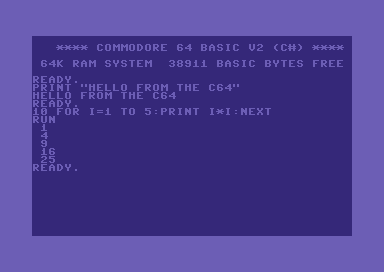
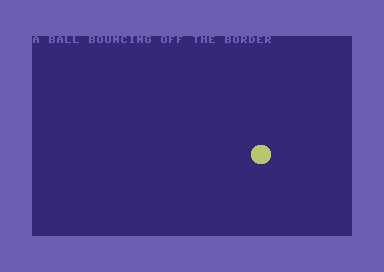

# C64Basic

A Commodore 64 **BASIC V2** interpreter written in C# (.NET 10), with a few editing and tooling extensions.
It interprets the language, and `SYS`/`USR` run machine code on a built-in 6502 core. There is no C64 ROM image: KERNAL and BASIC entry points are emulated in C#.
An opt-in [ROM mode](#rom-mode-the-real-roms-and-a-real-1541) runs the real C64 ROMs beside a real 1541 instead, if you have ROM dumps.

```
dotnet run --project src/C64Basic.Console                      # interactive READY. prompt
dotnet run --project src/C64Basic.Console -- samples/sieve.bas # run a program and exit
dotnet run --project src/C64Basic.Console -- --strict          # stock V2 only
dotnet test
```

There is also a windowed version with the real VIC-II picture, sprites, SID sound, keyboard and joystick:

 


```
dotnet run --project src/C64Basic.Gui                          # a 40x25 C64 screen in a window
dotnet run --project src/C64Basic.Gui -- --disk games.d64      # mount a disk image (or --tape x.t64 / x.tap)
```

See [The GUI](#the-gui) below. The terminal version's options:

Options: `--run <file>`, `--strict`, `--plain` (plain text stream: no emulated screen), `--fast` (don't slow execution to C64 speed), `--pixels` (the real VIC-II picture in the terminal, see below), `--width <n>` (emulated screen columns, centred with a border; 0 = terminal width; default 40, like a real C64), `--disk [n=]<file.d64>` (mount a disk image as device n, default 8; created blank if missing), `--tape <file.t64|file.tap>`, `--help`.
Press Ctrl+C to act as RUN/STOP.

## Layout

| Path | Contents |
|---|---|
| `src/C64Basic.Core` | the interpreter library: `Lexing`, `Parsing`, `Runtime`, `Editor`, `IO`, `Machine` (memory bus, 6502 CPU, VIC-II, SID, CIA, VIA, colour RAM, lockstep scheduler), `Rom` (ROM mode: the 1541, serial bus, disk mechanics, the whole machine), `Repl` |
| `src/C64Basic.Console` | terminal front end (`IConsoleDevice` over `System.Console`) |
| `src/C64Basic.Gui` | windowed front end on SDL2 (Silk.NET): VIC-II frames, SID audio, keyboard and joystick |
| `tests/C64Basic.Tests` | xUnit tests; `Harness.cs` has a scripted console and in-memory file system |
| `samples/` | example programs |

The core has no console dependency. A GUI only needs to implement `IConsoleDevice` and `IFileSystem`.

## What is faithful to V2

- Keywords are recognised anywhere, so `FORI=1TO10` works and a variable named `TOTAL` is read as `TO`+`TAL`.
- Names are significant to two characters; `$` strings and `%` 16-bit integers.
- Operator precedence, `-1` for true, 16-bit `AND`/`OR`/`NOT`.
- PRINT number formatting (`.333333333`, `1E+09`), 10-column comma zones, `TAB`, `SPC`.
- The classic error messages (`?SYNTAX  ERROR IN 40`). Syntax errors surface only when execution reaches them.
- 40-bit float range: `?OVERFLOW` above about 1.7E38.
- `FOR` bodies always run once, because the limit is tested at `NEXT`.
- `TI`, `TI$`, `ST`, `PEEK`/`POKE` on a 64K array, `DATA`/`READ`/`RESTORE`, `DEF FN`, `ON..GOTO/GOSUB`, `CONT`.

## Extensions (all off with `--strict`)

| Command | Effect |
|---|---|
| `RENUMBER [start[,step[,from]]]` | renumber lines and rewrite GOTO/GOSUB/THEN/ELSE/RUN/ON targets |
| `AUTO [start[,step]]` | prompt with line numbers; a blank line ends it |
| `TRACE [ON\|OFF]` | print `[line]` as each line runs |
| `DELETE a-b` | delete a range of lines |
| `FIND "text"` | list lines containing text |
| `IF .. THEN .. ELSE ..` | |
| lines up to 255 characters | stock limit is 80 |
| syntax errors show the source line with a `^` | |

`LIST` normalises case and expands `?` to `PRINT`.

## Files, WAIT, SYS and console codes

- `OPEN lf,dev,sa,"name[,S,W|R|A]"`, `CLOSE`, `PRINT#`, `INPUT#`, `GET#`, `CMD` and `ST` work on devices 0 (keyboard),
  3 (screen), 4/5 (printer), 1 (tape) and 8-11 (disk). Input items end at a comma, colon or CR. Without a mounted image, tape
  and disk are the host's working directory: sequential files are plain text with CR-separated records, kept in memory until
  `CLOSE`. The printer appends to `PRINTER.TXT`.
- **Disk drives** (`Core/Disk`): `--disk` mounts a real 35-track `.d64` image (block allocation map, directory chain, sector
  chains with interleave; every change is written back to the file). `OPEN` on it creates PETSCII `SEQ` files.
  `LOAD "$",8` loads the directory as a BASIC program (`LOAD "$0:A*",8` filters it), `LOAD "N",8,1` loads machine code at the
  file's own address, `SAVE "@0:N",8` replaces a file (without `@` an existing name is DOS error 63), and wildcards
  work (`LOAD "GA*",8`). Programs on disk are tokenized PRG files (`PrgFormat`); on the host directory `SAVE "x"` still writes
  readable `x.bas` source and `SAVE "x.prg"` writes tokenized bytes. LOAD/SAVE/VERIFY print the `SEARCHING FOR`/`LOADING`/
  `SAVING`/`OK` messages in direct mode, and `PRESS PLAY ON TAPE` etc. for device 1.
- **Command channel** (`OPEN 15,8,15`): `PRINT#15,"S:name"` (scratch, wildcards), `R:new=old`, `N:name,id` (format), `V` (validate),
  `I`, `C:new=a,b` (copy/concatenate). `INPUT#15,E,E$,T,S` reads `00, OK,00,00` style status (`62, FILE NOT FOUND`, `63, FILE EXISTS`,
  `72, DISK FULL`, ...). A failed OPEN or LOAD of a missing file still raises `?FILE NOT FOUND`; other DOS errors only show in the status.
  OPEN follows the drive: reading a file that is still open for writing gives `60, WRITE FILE OPEN`, writing a name that exists gives
  `63, FILE EXISTS` unless it starts with `@0:` (a host directory has always overwritten, and still does), and a type letter that
  does not match the file (`NAME,S,R` on a program) gives `64, FILE TYPE MISMATCH`. Nothing is written for a refused OPEN.
- **Relative files** on a `.d64`: `OPEN 2,8,2,"NAME,L,"+CHR$(length)` creates one (or opens an existing one without `,L,`), with real
  side sectors (six per file at most, 120 blocks each) and 1-254 byte records. `PRINT#15,"P"+CHR$(96+2)+CHR$(lo)+CHR$(hi)+CHR$(pos)`
  positions it (records and bytes count from 1); `PRINT#`, `INPUT#` and `GET#` then work by record, a CR ends a record and the rest is
  nulled, a record that was never written starts with `$FF`, and the drive reports 50 (record not present), 51 (overflow in record),
  52 (file too large) and 72 (disk full). Host directories and tapes answer 64.
- **Direct access** on a `.d64`: `OPEN 5,8,5,"#"` gives a 256-byte buffer channel. `U1`/`UA`/`B-R` read a block into it, `U2`/`UB`/`B-W`
  write it back, `B-P` moves the pointer, `B-A` and `B-F` allocate and free blocks in the allocation map (error 65 names the next free
  block). Arguments are channel, drive, track, sector, separated by spaces or commas; `B-R` leaves the pointer at 0 rather than at the
  length byte. `M-W` writes 2 KB of drive RAM (mirrored every 2 KB up to $1FFF, at most 34 bytes per command) and `M-R` reads it back
  through the command channel (`GET#15,A$`, one byte unless a count is given; afterwards the channel reports the status again). The ROM
  area reads as zero, and `M-E` answers `31, SYNTAX ERROR` because there is no drive processor to run code.
- **G64 images**: `--disk game.g64` (or dropping the file on the window) decodes the raw GCR tracks into the 683 ordinary sectors and mounts
  them as a read-only drive (changes stay in memory; the file is never written, unless ROM mode is asked to with `--write-g64`). A report on stderr says how many sectors were read cleanly
  and flags anything unusual: half-tracks, tracks past 35, bad checksums, odd speed zones. This only gets the *files* out. Most commercial
  games on G64s boot through a fast loader that uploads code to the drive with `M-W` and starts it with `M-E`, which needs a real 1541
  processor, and some rely on the real BASIC ROM's stack behaviour; those will list and load file by file but not start.
- **Tape**: `--tape` mounts a `.t64` archive or a `.tap` pulse image as device 1 (`LOAD "",1` loads the next program). A `.tap` is decoded
  and encoded in the KERNAL's standard format (leader, countdown, 192-byte header, data block, each recorded twice, odd parity,
  XOR checksum), taking the repeat when the first copy is damaged. Turbo loaders and other formats stay in the image but are not
  decoded. A tape cannot be edited in place: SAVE appends (the newest program of a name wins when loading), scratch and rename
  answer 26, and the `N:` command erases the whole tape.
- The KERNAL `LOAD` ($FFD5) and `SAVE` ($FFD8) calls work from machine code through `SETLFS`/`SETNAM`.
- `WAIT 198,n` waits for a key (works with a following `GET`); any other `WAIT` polls `PEEK` memory until RUN/STOP.
- `SYS addr` runs machine code on a 6502 core (all documented opcodes plus the stable undocumented ones, with cycle counts,
  decimal mode and RMW dummy writes; it passes Klaus Dormann's functional test). A, X, Y and P are loaded from and stored to
  780-783, as BASIC does, and the program ends at the first `BRK` (the default KERNAL vector returns to READY). `USR(x)` jumps
  through the vector at 785 with `x` in the floating-point accumulator ($61-$66) and takes the result from it. Jumps into
  KERNAL/BASIC ROM addresses without an emulation, and the unstable undocumented opcodes (XAA, AHX, TAS, SHX, SHY, LAS, LAX #)
  and JAMs, raise `?ILLEGAL QUANTITY`. Decimal-mode ARR is computed as in binary mode.
- Undocumented opcodes: LAX, SAX, DCP, ISC, SLO, RLA, SRE, RRA, ANC, ALR, ARR, AXS, the SBC alias $EB and every NOP variant.
- Emulated KERNAL entry points: CHROUT $FFD2, CHRIN $FFCF, GETIN $FFE4, STOP $FFE1, PLOT $FFF0, READST $FFB7, SETLFS, SETNAM,
  LOAD, SAVE, OPEN $FFC0, CLOSE $FFC3, CHKIN $FFC6, CHKOUT $FFC9, CLRCHN $FFCC, CLALL $FFE7 (files and the DOS command channel
  work from machine code on the same channels as BASIC's `OPEN`/`PRINT#`; errors come back in A with the carry set), SCNKEY (a
  no-op), clear screen $E544, home $E566, reset $FCE2, BASIC warm start $A474/$A483/$E37B (ends the SYS), and the interrupt
  tails $EA31/$EA7E/$EA81/$FEBC.
- Emulated BASIC ROM routines: MOVFM, MOVMF, MOVFA, MOVAF, FADD/FSUB/FMULT/FDIV/FPWR (number at A/Y) and their FADDT.. forms
  (FAC1 and ARG), SGN, ABS, NEGOP, INT, SQR, LOG, EXP, SIN, COS, TAN, ATN, RND, FCOMP, GIVAYF, FACINX, GETADR, QINT, FOUT, FIN,
  LINPRT and STROUT. They use the real memory layout (packed floats, FAC1 at $61, ARG at $69) with the C64's 40-bit precision,
  and errors surface as BASIC errors (`?OVERFLOW`, `?DIVISION BY ZERO`, `?ILLEGAL QUANTITY`).
- Interrupts are delivered while machine code runs. The CIA 1 timer and VIC-II raster IRQs go through the RAM vector at 788/789
  (or $FFFE/$FFFF once the KERNAL is banked out with `POKE 1`), so raster-interrupt programs work. The NMI (CIA 2 or the
  RESTORE key, PageDown in the GUI) goes through 792/793 (or $FFFA/$FFFB). The stock handler ignores it, except that
  RUN/STOP+RESTORE ends the SYS like a warm start. Execution is paced to 985 kHz unless `--fast`; Ctrl+C stops a runaway routine.
- In a terminal the console front end shows an emulated 40x25 C64 screen with border (true-colour ANSI): PETSCII home,
  cursor keys, reverse and the 16 colour codes, scrolling, and `POKE` to screen RAM (1024), colour RAM (55296),
  cursor row/column (214/211), text colour (646), border (53280) and background (53281). Typed letters show as
  upper case, as on a C64. Execution is paced at roughly 1500 statements/s so animations look right; use `--fast` to
  disable. PETSCII graphics from `CHR$` are drawn with Unicode box/block characters.
- `PEEK(53248..57343)` reads the character ROM after `POKE 1,PEEK(1) AND 251` (upper-case/graphics set; screen codes 0-63
  are exact, a few graphics are drawn, and the rest read as blank). `ASC` of a typed letter gives its upper-case PETSCII code.
  Programs that rely on 40-column line wrapping (e.g. `samples/banner.bas`) run correctly, since the screen is 40 columns by default.

## VIC-II, SID and CIA (core only)

`interp.Bus` models the VIC-II and SID registers. `Bus.Vic.Render(uint[])` draws a 384x272 ARGB frame: text,
multicolour and extended-colour text, hires and multicolour bitmaps, custom character sets, the VIC bank from
`$DD00`, and eight sprites (expansion, multicolour, priority, sprite-sprite and sprite-background collisions).
`$D012`/`$D011` give a raster line that advances at 50 Hz (312 lines of 63 cycles) and the raster-compare flag is set in `$D019`.
The picture is drawn per raster line from a log of register writes, so changes made mid-frame by raster interrupts show up where
they were made: colour bars, split screens, sprite multiplexing (a sprite register rewritten after its line is drawn gives a second
sprite), fine scrolling (`$D011`/`$D016`), and the border tricks that open the top/bottom border (RSEL switched at the right line) and
the side borders (CSEL switched at cycle 56/57). While machine code runs (`SYS`) the clock follows the instructions cycle for cycle,
interrupts are taken after every instruction, and the VIC-II steals cycles on bad lines (about 40) and for sprites (2 each, plus 1 for the first, each at the sprite's own place in the line: sprite 0 at cycle 58, then every 2 cycles),
so a stable raster interrupt sees the same line every frame. BASIC itself runs on the host's clock.
`Bus.Sound.Render(short[], sampleRate)` produces mono audio: three voices, four waveforms, ring modulation,
sync, ADSR, a state-variable filter and volume. `Bus.Sound.Model` picks the 6581 (default; dark, strongly non-linear filter,
combined waveforms lose bits) or the 8580 (`--sid 8580` in the GUI; linear cutoff, cleaner combinations). Noise combined with another
waveform locks up as on the real chip. The combined waveforms are modelled, not sampled from real chips. `IVideoDevice` and `IAudioDevice` are the interfaces a front end
implements to show and play these; the terminal front end does not, so sprites and sound only come out through a
host that calls them (use `src/C64Basic.Gui`). `Vic.LightPen(x, y)` is a light pen strike: the first in a frame latches `$D013`/`$D014` and sets the interrupt flag (bit 3). A SID frequency register tops out near 3.8 kHz, as on a real chip.

`Bus.Cia1`/`Cia2` are 6526 chips with two ports, two timers (also chained), time of day with the hours latch, and an
interrupt register; they run from `Bus.Seconds`. CIA 1 reads a host-supplied `IInputDevice` through the real keyboard
matrix and joystick ports (`PEEK(56320)` for joystick 2), CIA 2 port A picks the VIC bank, and CIA 1 timer A is
the 60 Hz system interrupt (`InterruptPending`, for the CPU to poll). With an `IInputDevice` set on `Bus.Input`,
`PEEK(197)` gives the KERNAL key index (64 = none) and `PEEK(653)` the shift/C=/CTRL flags. The jiffy clock at
160-162 and `TI` are the same clock, and `POKE` to 160-162 sets `TI`. Timers A/B drive PB6/PB7 (pulse or toggle), the shift register
clocks a byte out on timer A (`SerialOut`) or takes one from the host (`ReceiveSerial`) and raises its interrupt, and the TOD alarm sets
flag 4. `Cia.PulseCnt(n)` feeds pulses to the CNT pin: timer A counts them (CRA bit 5), timer B counts them or A's underflows, optionally
only while `CntHigh` (CRB bits 6-5). Nothing in the front ends drives CNT; it is for hosts and tests. `PulseFlag()` is a falling edge on FLAG (ICR bit 4). `Bus.Cia2.UserPortInput`/`UserPortOutput` are the user port pins (PB0-7). Saved machine states (`.sav`, version 2) include the timer outputs, shift register and CNT level; version 1 files load too.

**Paddles:** `IInputDevice.Paddle(port, axis)` is what the SID reads at `$D419`/`$D41A`; CIA 1 port A bits 7-6 pick the game port (`POKE 56320,64` =
port 1, `128` = port 2, as the C64 documents it; selecting both or neither reads 0). The fire buttons are the joystick's left and right bits
(`PEEK(56320)` bits 2 and 3). In the GUI the mouse is a paddle on the port the numpad drives: its position is POTX/POTY (0-255 across the
window), the left button is fire A and the right button fire B. With `--lightpen` the mouse is a light pen on port 1 instead: holding
the left button over the picture strikes the pen at that beam position (`Vic.LightPen`: `$D013`/`$D014` and interrupt flag 3) and holds the
joystick fire line (`PEEK(56321)` bit 4) low.

## The picture in a terminal (`--pixels`)

`dotnet run --project src/C64Basic.Console -- --pixels` draws the real VIC-II frame in the terminal: every frame (15 per second) is
shrunk to fit the window (never enlarged) and shown with upper half blocks in true colour, so sprites, bitmap and multicolour modes,
custom character sets and colour effects appear. Text is only legible when the terminal is big enough (about 130 columns and 40 rows
for readable text; a smaller one still shows graphics clearly). It uses the same screen editor, keyboard buffer and cursor as the GUI,
so the prompt works the same way: arrows, Home (Shift+Home clears), Backspace/Delete, Insert, F1-F8, Ctrl/Alt+1-8 for colours. Esc
is RUN/STOP, Ctrl+C breaks too, and Ctrl+D quits. A terminal paste types as fast as it arrives. The terminal version has no sound or joystick; those are in the GUI.
A terminal never reports a key release, so each typed key is held on the key matrix for about 90 ms: machine code scanning
`$DC00`/`$DC01` (and `PEEK 197`) sees it, but two keys held at once, and Ctrl/Commodore/Shift on their own, are not seen. Without `--pixels` the terminal shows the faster text-only screen.

## The GUI

`src/C64Basic.Gui` opens a window and runs the interpreter on its own thread. All output goes through the C64's own memory
(`ScreenConsole`/`ScreenEditor` in Core write screen RAM, colour RAM and the cursor in zero page), and the window shows what
`Bus.Vic.Render` draws from it. So `POKE 53280` borders, sprites, bitmap and multicolour modes, custom character sets and
`PEEK` of screen RAM all work, and machine code can drive the screen directly. SID audio plays through SDL.

- Options: `--scale <1-8>`, `--fast` (start in warp mode), `--fullscreen`, `--strict`, `--disk [n=]<file.d64>`, `--tape <file.t64|file.tap>`,
  a program to load and run, `--type <text>` and `--snapshot <file.bmp>` (for scripting and screenshots).
- The prompt is the real screen editor: cursor keys move around, RETURN reads the logical line under the cursor (an old
  `LIST` line can be edited and re-entered), long lines wrap and are read back as one, DEL/INST work, the key buffer holds
  ten characters.
- Keys: Esc = RUN/STOP, F1-F8, Home (Shift+Home clears), Ctrl+1-8 / Alt+1-8 pick the text colour, Ctrl+9/0 reverse on/off.
  The key matrix is live for machine code that scans `$DC00`/`$DC01`; the numpad is a joystick (8/2/4/6, 0 = fire) on port 2, or on port 1 with `--joy 1` or the Pause key. Game controllers work too: the
  first is on port 2, the second on port 1, with the D-pad or left stick for directions and A/B/X/Y for fire, and they can be plugged in
  while the window is open.
  F9 toggles warp speed, F10 resets, F11 or Alt+Enter toggles full screen, F12 saves a screenshot. Dropping a `.d64`, `.t64`, `.tap`,
  `.prg` or `.bas` file on the window mounts or loads it.
- Keyboard joystick: the JOY button (Ctrl+J) cycles the cursor keys between being cursor keys, a joystick on port 1 and a joystick on port 2,
  with Space or Right Ctrl as fire (Space still types a space); the numpad follows to the same port. Games differ in the port they read:
  Ms. Pac-Man reads port 1, many read port 2. Pause moves the numpad joystick between the ports without touching the cursor keys.
- Toolbar and mouse: a toolbar of buttons runs along the top of the window (OPEN, JOY, RESET, WARP, SAVE, LOAD, COPY, PASTE, SHOT, FULL; ROM mode adds
  PAUSE, DISK-, DISK+, TAPE and REWIND), each with its key shown in the title bar while the pointer is over it, lit while a toggle is on. It
  hides in full screen, `--no-toolbar` leaves it out and Ctrl+F12 switches it on and off. Shift + left drag picks text off the screen (the
  picked cells are drawn inverted) and copies it when the button is let go; COPY and Ctrl+C copy the selection, or the whole screen if
  nothing is picked; a middle click, PASTE, Ctrl+V and Shift+Insert type the clipboard. Without Shift the mouse is still the paddle (or the
  light pen), and any key or an ordinary click drops the selection.
  OPEN (Ctrl+O) shows the system's file dialog (the common dialog on Windows, `zenity` or `kdialog` on Linux, AppleScript on macOS) to pick a
  disk, tape, cartridge, program or state file, the same as dropping it on the window. In ROM mode a picked disk (`.d64`, `.g64`, `.t64`,
  `.prg`) or `.tap` resets the machine and starts its first program (`LOAD"*",8,1` and `RUN`, or `LOAD` and `RUN` for a tape); a `.crt` resets
  into the cartridge and a `.sav` loads the state.
- Machine state: Ctrl+S saves the whole machine (memory, VIC-II, SID and CIA registers, the BASIC program, variables, arrays, `DEF FN`
  functions, FOR/GOSUB stacks, the DATA pointer and the clock) to `c64-state.sav` (`--state <file>` changes the name) and Ctrl+L loads
  it; `--resume` loads it at startup and dropping a `.sav` file on the window loads that. A program that was running carries on
  (the window types `CONT` for it). Saving happens between BASIC statements or at the prompt, so it waits while a `SYS` routine runs.
  Open files are closed by a load, and the drives and the character ROM are configuration that stays as it is.
  In code: `Interpreter.SaveState()` / `LoadState(bytes)`, or `SaveStateLater` / `LoadStateLater` from another thread. A damaged file
  is refused without changing anything.
- Clipboard: Ctrl+V or Shift+Insert types the clipboard (line breaks become RETURN; characters the C64 keyboard cannot produce are
  dropped; at most 64 KB), so a BASIC listing can be pasted in. Ctrl+C copies the screen as text.
- Character sets: the real ROM is copyrighted, so the built-in set is drawn in this project (C64-style letters and digits,
  hand-drawn graphics for screen codes 64-127, a lower-case set, reversed halves). Shift+Alt (Shift+Commodore) or
  `PRINT CHR$(14)` / `CHR$(142)` switches between the upper-case/graphics and lower-case sets (`$D018` bit 1). To use the
  real glyphs, pass a 4096-byte dump with `--chargen <file>`. `Bus.LoadCharacterRom` does the same in code.
- Typing is like the real keyboard: Shift+letter gives a graphics symbol (a capital in the lower-case set), and quote mode
  works. After an opening quote control keys (colours, cursor, CLR) show as reverse symbols and read back as the codes, so
  `PRINT "<Ctrl+2>HELLO"` can be typed. RETURN or the closing quote ends it.
- Limits: the graphics are approximations of the real shapes. The mouse is the only paddle (one at a time, on the numpad's port); game
  controller triggers do not drive paddles.

## ROM mode: the real ROMs and a real 1541

The interpreter is a fast and friendly way to run BASIC, but it cannot run what needs the real machine: a **fast loader** that uploads its
own code to the disk drive and races the serial bus, 1541 copy protection, programs that call KERNAL or BASIC routines this project
does not emulate. ROM mode runs the actual thing instead: the C64's own BASIC and KERNAL ROMs on the 6502 (banked by the processor
port, with the real interrupt handler, keyboard scan and serial bus routines), and beside it a 1541, a second 6502 running the DOS ROM
with 2 KB of RAM and two 6522 VIAs, reading a disk image through a model of the head, the stepper, the motor and the GCR read channel.
The interpreter stays the default; ROM mode is opt-in.

```
dotnet run --project src/C64Basic.Gui -- --rom-dir roms --disk game.g64     # then LOAD"*",8,1 and RUN
dotnet run --project src/C64Basic.Console -- --rom-dir roms --disk game.d64 # in a terminal (the --pixels picture)
```

The ROM dumps are copyrighted and **not part of this project**; put them in a folder (git-ignored here as `roms/`). They are found by
name or by size: the 8 KB BASIC ROM (`basic-901226-01.bin`), the 8 KB KERNAL (`kernal-901227-03.bin`, stock PAL), the 16 KB 1541 DOS ROM
(`dos1541ii-251968-03.bin`, the 1541-II's DOS 2.6) and optionally the 4 KB character ROM (`chargen*.bin`, otherwise the built-in
approximation is used). The checksum is only used to say which ROM it is. Tests that need the ROMs do nothing without them.

What you get: the real boot (a RAM test, then the banner after about three seconds), BASIC V2 as Commodore wrote it, `LOAD`, `SAVE`,
`OPEN` and the command channel through the real serial routines against the real DOS, D64 and G64 images (a G64 is the raw bit stream
of every track, half-tracks and speed zones included), disk swaps, `RESTORE` and RUN/STOP+RESTORE, the joystick, paddles and light pen,
and a keyboard that goes through the matrix (so Ctrl, the Commodore key and Shift behave like the real ones).

ROM mode has up to two drives: `--disk 8=a.d64 --disk 9=b.d64` puts a second 1541 (its own 6502 running the DOS, in the same lockstep) on the
serial bus as device 9, so `LOAD"X",8` and `SAVE"X",9` copy between disks; the window title shows which drive is turning. A state file
keeps the number of drives it was taken with.

**Expansion port (ROM mode):** `--cart <file.crt>` plugs in a cartridge image and `--reu <kb>` a RAM expansion unit; both reset the machine (dropping
a `.crt` on the window does too). The memory map follows the GAME and EXROM lines: an 8 KB cartridge shows at $8000 while LORAM and HIRAM are set,
a 16 KB one also at $A000 in place of BASIC (HIRAM), and Ultimax mode (GAME low, EXROM high) gives the cartridge $8000 and $E000 (its own reset
vector) with RAM only at $0000-$0FFF. The KERNAL starts a cartridge with the `CBM80` signature itself. CRT hardware types supported: 0 (normal),
5 (Ocean), 15 (C64 Game System), 19 (Magic Desk) and 32 (EasyFlash, read only: the flash cannot be written, so a program that saves to it will
not keep anything); freezer and other cartridges are refused. The REU (128 KB to 16 MB, registers at $DF00-$DF0A) does C64-to-REU, REU-to-C64,
swap and verify transfers with the fixed-address and autoload options, the FF00 trigger and the end-of-block and verify-error interrupts;
a transfer takes a cycle a byte with the processor held. A cartridge and an REU share $DF00, so the cartridge wins. Saved states keep the
bank registers and the REU's contents but not the cartridge's ROM: start with the same `--cart` and `--reu` to load one.

In the ROM mode window: Ctrl+N and Ctrl+B swap the disk in drive 8 for the next or previous `.d64`/`.g64` in the same folder, in name order (the
disks of a multi-disk game side by side), Scroll Lock pauses the machine and shows the registers of the processors, the raster line and the drive's
head in the title, and dropping a `.tap` mounts a tape (a `.t64` or `.prg` goes on a blank disk).

`--disk` also takes a `.t64` tape image or a single `.prg`: its programs go on a blank disk in memory (nothing is saved back), then
`LOAD"NAME",8,1` and `RUN` as usual.

`--tape <f>` in ROM mode is a datasette on the cassette port with PLAY pressed: a `.tap` is fed to CIA 1's FLAG pin pulse by pulse
while the KERNAL's motor line (bit 5 of the processor port) is low, so the real tape routines (and turbo loaders) read it, the sense switch
(bit 4) reads closed, and `LOAD` / `SAVE` without a device number use the tape, with the KERNAL's own timing (a program takes a minute or two
of emulated time). A `SAVE` records the rising edges of the write line (bit 3) as pulses and adds them to the tape when the motor stops; a
missing `.tap` is created empty and written. A `.t64` is put on a tape in the KERNAL's format, in memory. A saved state keeps the tape position
(the tape file itself is mounted again by the host). In the window Ctrl+T lets go of PLAY and presses it again, Ctrl+R rewinds (`RomMachine.StopTape`, `PlayTape`, `Tape.Rewind`).

The drive **writes**, too: the write head puts what the DOS sends on the track, so `SAVE`, `SCRATCH`, `VALIDATE`, block commands and a
full `NEW` (format) work against the real DOS. A mounted `.d64` file is saved back after every write (once all its sectors read cleanly
again, so never half-way through a format; a missing `.d64` is created blank). A `.g64` is someone else's raw tracks: the drive may write
to the copy in memory, the file is never touched, and the title says so. The undocumented opcodes copy protection likes are there too,
the unstable ones (XAA, LAX #, AHX, TAS, SHX, SHY, LAS) with the values most emulators agree on.

Ctrl+S and Ctrl+L save and load the whole machine (`--state <file>`, `--resume`): both processors, RAM, every chip, the drive's head
and the disk as it is now. It is exact: a state taken in the middle of a fast load carries on to the same bytes as the original run.
The window title shows the drive at work (`1541: track 18`, `writing`); `--iec-rise <us>` changes the serial bus rise time (below).

The VIC-II holds the C64's processor up cycle by cycle (BA/AEC): BA goes low three cycles before the chip needs the bus (cycle 12 of a bad
line, cycle 55 for the first sprite), the 6502 stops in its first read cycle after that, writes carry on for up to three cycles (a `STA` or
an interrupt's pushes slip through), and it runs on when BA is high again (cycle 55 on a bad line). So a bad line costs a processor that
reads 43 cycles (40 if it was pushing), a sprite 2 and the first of a row of sprites 3 more (8 sprites: 19). Stretches that are less than
three cycles apart are one. The cost is worked out before the instruction runs, so a read of `$D012` or a CIA register after a stall sees
the time after it, and the scheduler orders the processors by it. A page crossing or a taken branch (the cycle it adds) is not held up.

How the two processors stay in step: the C64 (985248 Hz) and the drive (1 MHz) run in lockstep. The one whose next bus access, the data
access in the last cycle of its next instruction, comes first takes the next step, so a store by one and a load by the other happen in
the right order within a cycle. That is what a fast loader needs: the 1943 loader here sends two bits at a time with a window of a couple
of microseconds, and only works when a released serial line rises about a microsecond late (a line is only pulled up by a resistor through
the cable's capacitance), which the model has: 1.2 microseconds, and anything from about 0.8 to 1.7 loads the game, none at all does
not. If a fast loader that works on a real machine fails here, `--iec-rise` is the knob to try. A boot from a game image takes about a
minute of emulated time, the same as the real machine, and `--fast` skips the speed limit. Measured in a Release build (BASIC idle, and a fast
loader at work), ROM mode runs about 17 to 19 times faster than the real machine, so a boot with `--fast` takes a few seconds.

Games are tested against real images kept in `roms/games` (git-ignored, copyrighted, so the tests skip on a machine without them): `GameCorpusTests`
loads every `.d64`, `.g64`, `.t64` and `.prg` there and lists its directory, and runs the ones it knows by name to their title screen. Known to work:
1943 (a G64 with a drive-code fast loader), International Karate Plus (a D64, a 200-block KERNAL load, then the cracker's raster-bar intro and menu)
and Ms. Pac-Man (a T64, put on a blank disk). To add a game, drop the image there and add a row to that file.

Known limits: a gate-for-gate chip simulation this is not. The VIC-II is the same frame renderer as the interpreter's (raster tricks
and bad lines, but not every cycle-level effect), freezer cartridges and cartridge flash are not there, and the jams ($02, $12, ...) stop the machine with a message in the title bar.
The disk head counts its cells at the speed the density bits (PB5-PB6 of VIA 2) select, as the real one does, and the disk turns at 300 rpm
whatever they say: with the density a track was recorded at every bit is read as recorded, with another one the stream is sampled at the wrong
rate (a bit is missed or seen twice), so code that sets the density wrong, or a protection that records at an odd speed, sees what it would on
a real drive. What the head writes is recorded at the density it is set to, so a track can end up with bytes of different speeds; a G64
keeps those (and any per-byte speed table it came with) when it is written back. A mounted G64 is only written back with `--write-g64`
(then the file is rewritten from the tracks, and the first time the original is copied to `name.g64.bak`); a D64 is always saved back. The stepper
moves a half-track per phase change; a jump of two phases (the opposite coil) carries on the way the head was going, a model of an unstable
position, not a measured one. A written track keeps its length (bits are overwritten in place, a different density does not change how many fit).

## Not implemented

`USR` without a vector raises `?ILLEGAL QUANTITY`. Running code in the drive (`M-E`, so fast loaders and 1541 copy protection; ROM mode does that), turbo-tape formats and DOS errors beyond
those listed are missing, as are any `POKE`/`PEEK` hardware registers not listed above. `PEEK` of screen RAM, colour RAM and the
cursor (214/211) see printed text everywhere, including `--plain`, which keeps a hidden screen behind the text stream (typed input is not echoed into it).
`LOAD`/`SAVE` without a device number use device 8 (the disk); with `--strict` they use device 1 (the tape) like a real C64.
A directory loaded with `LOAD "$"` keeps its lines in file order, so several files with the same block count each show up; typing a
line number then replaces the first line with that number or goes in before the first larger one, like the real line editor.

Known deviation: a `FOR` loop's resume point is a statement index, which is exact for all cases including
`GOSUB` inside an `IF` clause. The extension words `FIND`, `TRACE`, `RENUMBER` and `ELSE` can be used as variable names (the
extension commands are only recognised at the start of a statement and not before `=`, `ELSE` only after a finished clause), but
`AUTO` and `DELETE` split into `AU`+`TO` and `DE`+`LET`+`E` exactly as they would on a real C64. `--strict` removes the extensions.

## Performance

Drawing a frame takes about 1.5 ms whatever the program did to the VIC-II registers: the register log is replayed per line, and it is folded
into the starting state past 20,000 entries, so a program that writes a register every cycle for seconds costs nothing extra (2 million
logged writes take about 0.4 s, 0.2 microseconds each). Measured with a Release build on a desktop PC.

## Samples

`samples/` holds programs that run in the terminal (`hello`, `sieve`, `banner`, `ball`, `extras`, `disk`, `sysdemo`) and ones that
need the GUI to be seen or heard: `sprite.bas` (a bouncing sprite), `sid.bas` (a scale on the SID), `joystick.bas` (numpad
joystick). The test suite runs them all headless.

## Tests and releases

`dotnet test` runs the xUnit suite. Klaus Dormann's 6502 functional test runs too if `C64_6502_FUNCTIONAL_TEST` points at
`6502_functional_test.bin` (not included: it is GPL). `.github/workflows/ci.yml` builds and tests on Linux and Windows, and a
`v*` tag publishes self-contained terminal and GUI builds for win-x64, linux-x64 and osx-arm64 as release assets. CI also starts
the GUI with SDL's dummy video and audio drivers as a smoke test. What needs a real screen, keyboard and speakers is listed in
[docs/GUI-CHECKLIST.md](docs/GUI-CHECKLIST.md).

## License

MIT, see [LICENSE](LICENSE). The C64 ROMs are not included and not needed.
